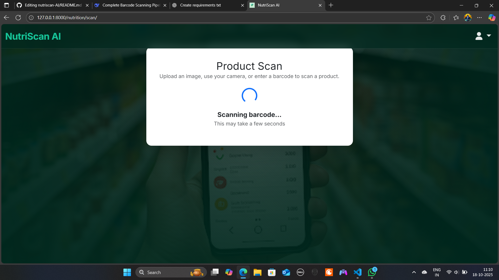

# 🍏 NutriScan AI: Your Personal AI Nutritionist


_Replace the link above with a GIF of your app in action!_

<p align="center">
  
  
  
</p>

NutriScan AI is a smart web application designed to be your personal dietary advisor. Simply scan a food product's barcode, and our AI, powered by state-of-the-art language models, provides a detailed nutritional analysis tailored to **your personal health profile and goals**.

---

## ✨ Key Features

* **📷 Real-time Barcode Scanning:** Use your device's camera to scan barcodes directly in the browser.
* 🧠 **AI-Powered Analysis:** Leverages a Hugging Face model to analyze nutritional data and provide human-like advice.
* 👤 **Personalized Recommendations:** Get advice based on your age, weight, health conditions, and dietary goals.
* ⚖️ **Pros & Cons:** Receive a clear, balanced list of the product's benefits and drawbacks.
* ✅ **Simple Advisability Score:** A clear "Yes," "No," or "With Caution" to help you make quick, informed decisions.
* 📚 **PDF Knowledge Base:** The AI's knowledge is enhanced by a foundational healthy diet guide, ensuring its advice is well-grounded.

---

## 🛠️ Tech Stack

* **Backend:** Django
* **AI & Machine Learning:** Hugging Face `InferenceClient`, PyMuPDF, PyTorch, EasyOCR
* **Frontend:** HTML5, CSS3, JavaScript
* **Database:** SQLite (for development), PostgreSQL-ready for production
* **Deployment:** Gunicorn, Whitenoise

---
## 📸 Screenshots

<div align="center">
  <table>
    <tr>
      <td></td>
      <td></td>
    </tr>
    <tr>
      <td align="center"><em>Home Page</em></td>
      <td align="center"><em>Barcode Scanning</em></td>
    </tr>
    <tr>
      <td></td>
      <td></td>
    </tr>
    <tr>
      <td align="center"><em>Barcode detection</em></td>
      <td align="center"><em>analysis Results</em></td>
    </tr>
  </table>
</div>

## 🚀 Getting Started

Follow these instructions to get a local copy up and running for development and testing.

### Prerequisites

* Python 3.10+
* Git

### Installation & Setup

1.  **Clone the Repository**
    ```sh
    git clone [https://github.com/your-username/nutriscan_ai.git](https://github.com/your-username/nutriscan_ai.git)
    cd nutriscan_ai
    ```

2.  **Create and Activate a Virtual Environment**
    * On Windows:
        ```sh
        python -m venv venv
        .\venv\Scripts\activate
        ```
    * On macOS/Linux:
        ```sh
        python -m venv venv
        source venv/bin/activate
        ```

3.  **Install Dependencies**
    ```sh
    pip install -r requirements.txt
    ```

4.  **Set Up Environment Variables**
    Create a `.env` file in the project root and add your secret keys. You can use the `.env.example` as a guide:
    ```ini
    # .env file
    DJANGO_SECRET_KEY='your-strong-secret-key'
    DEBUG=True
    HF_TOKEN='your-huggingface-api-token'
    ```

5.  **Run Database Migrations**
    ```sh
    python manage.py migrate
    ```

6.  **Start the Development Server**
    ```sh
    python manage.py runserver
    ```

7.  **Access the Application**
    Open your browser and navigate to `http://127.0.0.1:8000/`

---

## 🤝 Contributing

Contributions are what make the open-source community such an amazing place to learn, inspire, and create. Any contributions you make are **greatly appreciated**.

1.  Fork the Project
2.  Create your Feature Branch (`git checkout -b feature/AmazingFeature`)
3.  Commit your Changes (`git commit -m 'Add some AmazingFeature'`)
4.  Push to the Branch (`git push origin feature/AmazingFeature`)
5.  Open a Pull Request

---

## 📜 License

Distributed under the MIT License. See `LICENSE` for more information.

---

## 📧 Contact

Your Name - [@your_twitter_handle](https://twitter.com/your_twitter_handle) - your.email@example.com

Project Link: [https://github.com/your-username/nutriscan_ai](https://github.com/your-username/nutriscan_ai)
