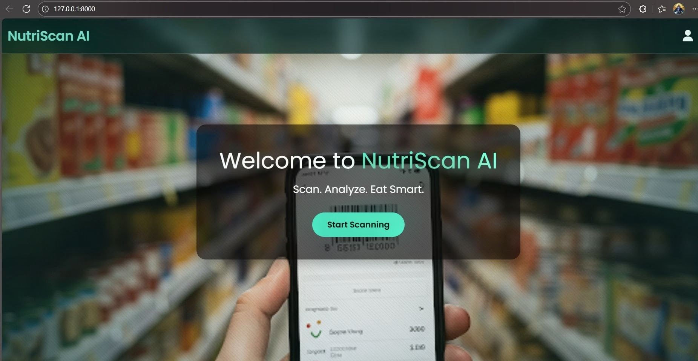
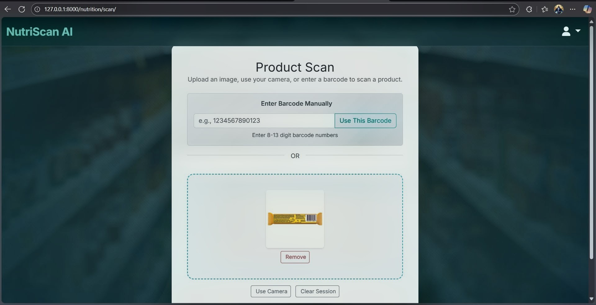
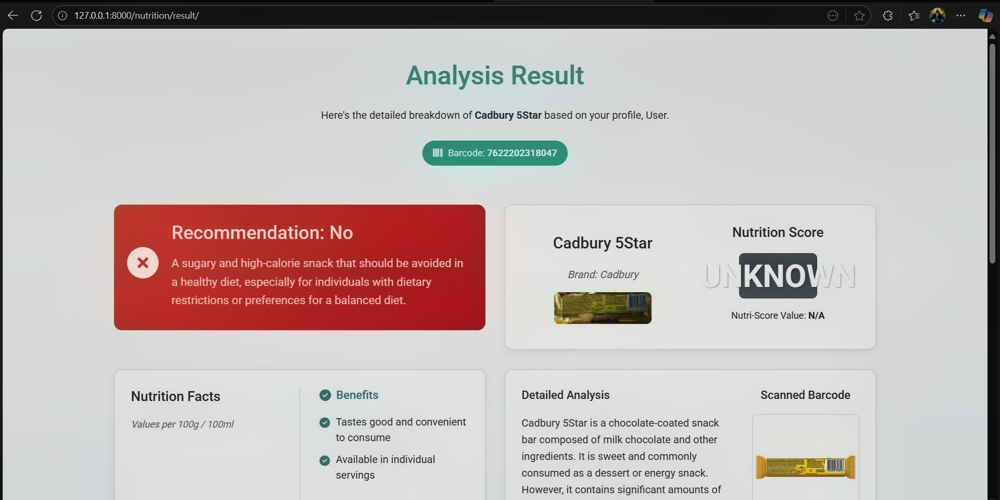

# NutriScan AI

A Django web application that scans packaged food barcodes and generates
personalised nutrition recommendations using an LLM, grounded in the user's
health profile.

**Disclaimer**: NutriScan AI is an informational tool only. Its output is
not a substitute for advice from a registered dietitian or medical
professional.

---

# What It Does

Most nutrition labels are accurate but not useful. Knowing that a biscuit
contains 28 g of sugar per 100 g doesn't tell a diabetic whether they should
eat it.

NutriScan AI bridges that gap by combining:

1. Barcode scanning — detects barcodes from uploaded images or live
   camera capture using a two-stage pipeline:
   
   - pyzbar direct decode
   - YOLOv5-assisted region detection (fallback)

2. Product lookup — fetches nutritional data from
   https://world.openfoodfacts.org/

3. Personalised analysis — sends product data along with user profile
   (age, weight, height, health conditions, goals) to a hosted Llama 3 8B model
   and returns:
   
   - Advisability: Yes / No / With Caution
   - Pros & Cons
   - Short explanation

---

## Screenshots

| Home | Scan | Result |
|------|------|--------|
| 

---

# Tech Stack

Layer| Technology
Backend| Django 5.2
Authentication| Custom "AbstractUser" (email-based login)
Barcode detection| pyzbar + YOLOv5 + OpenCV
LLM| Hugging Face Inference API (Llama 3 8B via Novita)
Knowledge base| PyMuPDF (WHO diet guide)
Product data| Open Food Facts API
Frontend| Bootstrap 5.3, Vanilla JS
Static files| Whitenoise
Database| SQLite (dev), PostgreSQL-ready
Server| Gunicorn

---

# Architecture

Browser
  │
  ├── GET  /nutrition/scan/
  ├── POST /nutrition/scan/  (AJAX → barcode detection)
  ├── POST /nutrition/scan/  (analysis pipeline)
  └── GET  /nutrition/result/

Backend Flow:
Scan → Barcode Detection → Product API → User Profile → LLM → Result

Internal Structure

Apps
  ├── accounts/
  ├── home/
  └── nutrition_analysis/
        ├── views.py
        ├── forms.py
        └── services/
              ├── barcode_scanner.py
              ├── nutrition.py
              └── product_lookup.py

---

# Local Setup

Prerequisites

- Python 3.10+
- Git
- Hugging Face API token

# Steps

git clone https://github.com/YOUR_USERNAME/nutriscan-ai.git
cd nutriscan-ai

python -m venv venv
source venv/bin/activate   # Windows: venv\Scripts\activate

pip install -r requirements.txt

Create ".env":

DJANGO_SECRET_KEY=your-secret-key
DEBUG=True
HF_TOKEN=your-token
ALLOWED_HOSTS=localhost,127.0.0.1

Run:

python manage.py migrate
python manage.py runserver

Open: http://127.0.0.1:8000/

---

# How to Use

1. Sign up and complete your profile
2. Go to Scan page
3. Upload / capture barcode
4. Click Scan → Analyse
5. View personalised recommendation

---

P# roject Structure

nutriscan-ai/
├── accounts/
├── home/
├── nutrition_analysis/
│   ├── services/
│   └── views.py
├── static/
├── templates/
├── manage.py
└── requirements.txt

---

Barcode Detection Pipeline

Stage 1: pyzbar (fast, direct)
Stage 2: YOLOv5 → crop → OpenCV BarcodeDetector

Returns:

- barcode value
- annotated image

---

LLM Analysis

- Model: Llama 3 8B
- Temperature: 0.2
- Output: structured JSON

Input includes:

- product nutriments
- Nutri-Score
- user profile
- WHO diet knowledge (PDF extracted)

Parser includes fallback handling for inconsistent outputs.

---

# Contributing

1. Fork the repo
2. Create a branch
3. Commit with clear messages
4. Open PR

---
